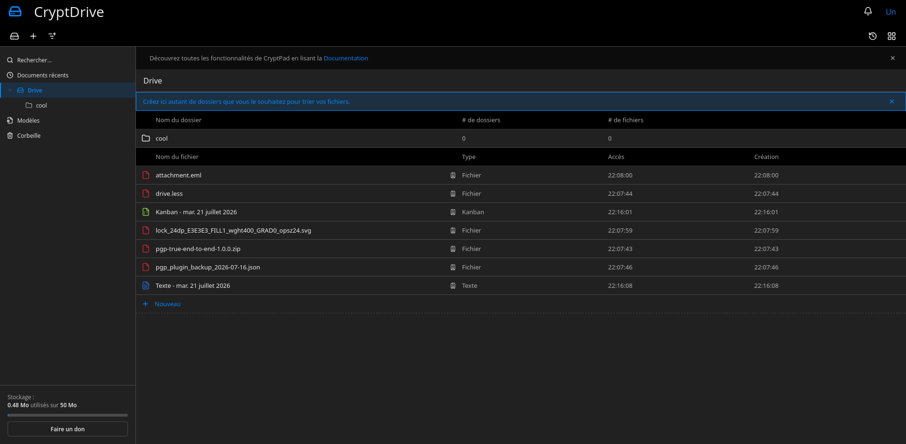
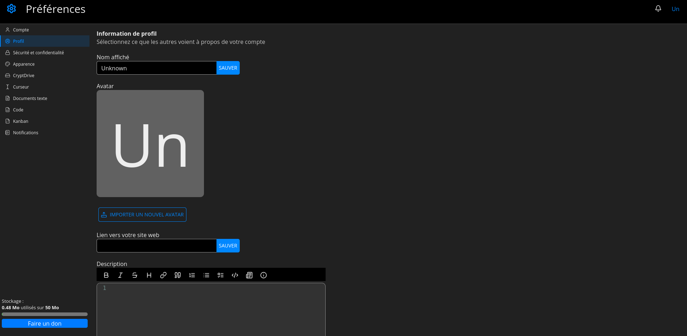

## Cryptpad UI Refresh
If you don't know what is Cryptpad, see [here](https://cryptpad.org/). It is a very cool project but I don't like the UI. However, the team offers the possibility to customize the Look and Feel of the app, so here we go ! To install it, simply copy the content of `customize` into your root cryptpad installation, then restart service. If you don't like the theme, simply remove the folder and restart.
## Screenshots
The folowwing have been taken with default blue theme activated and Dark theme enabled. Be assured, it works in the same way with the others colors and theme.

